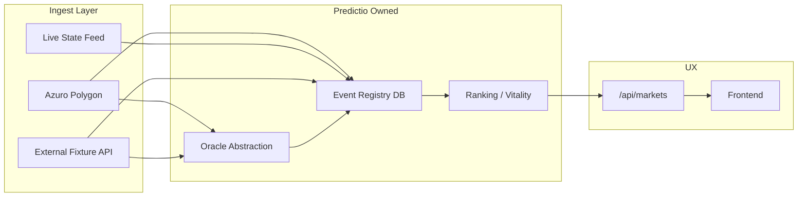

# PR19 — Inventory Collapse Forensics + Event Recovery + Oracle Strategy

**Date:** 2026-05-18  
**Forensics script:** `scripts/pr19-inventory-forensics.mjs`  
**Sample JSON:** `docs/samples/pr19/`

---

## Executive summary

| Finding | Verdict |
|---------|---------|
| **Primary collapse point** | **Azuro upstream** — zero Prematch fixtures with `startsAt` in next 72h |
| **Predictio filter murder** | **NOT primary** — pipeline passes 100% of Azuro `startsAt_gte:now` pool (43/43) |
| **Premier League missing** | **0 future PL** in Azuro; 47 PL rows exist but **all stale Prematch (past kickoff)** |
| **World Cup dominance** | Correct reflection of Azuro future pool (~24 days out, June 11+) |
| **PR19 fix** | Live football ingest + catalog live window + far-future sort demotion |

---

## 1. Inventory collapse findings

### Collapse funnel (live audit 2026-05-18T21:16Z)

| Stage | Count | Notes |
|-------|-------|-------|
| Azuro all Prematch (no date filter) | **960** | Includes 645+ **past-kickoff stale Prematch** |
| Azuro Prematch `startsAt_gte:now` | **43** | **100% World Cup** |
| Next 72h (any league) | **0** | Empty at source |
| Pipeline `emergencyMinimalTradable` | **43 passed** | Zero rejections |
| Production `/api/markets` | **43** | Matches upstream |
| Production open curated active | **20** | Vitality cap + sync slice |

**Exact collapse point:** Between **Azuro GraphQL `startsAt_gte:now`** and human expectation — not between Predictio pipeline stages.

### Why it feels like "filter murder"

Predictio uses `minStartsAtSec: nowSec` in `buildRawFeedCatalogPayload` → `fetchAzuroGames`. This **correctly excludes** ~917 stale Prematch zombies (May 10–17 still marked Prematch). Without this filter, the catalog would show **dead matches** — worse UX.

---

## 2. Raw feed findings

**Endpoint:** `https://thegraph-1.onchainfeed.org/subgraphs/name/azuro-protocol/azuro-data-feed-polygon`

| Metric | All Prematch | startsAt_gte:now | Live state |
|--------|--------------|------------------|------------|
| Total | 960 | 43 | 48 |
| Football | 495 | 43 | 17 |
| Premier League | 47 | **0** | 0 |
| UCL | 8 | **0** | 0 |
| Serie A | 26 | **0** | 2 |
| World Cup | 49 | **43** | 0 |
| Next 72h | **0** | **0** | 0 |

### Per-day distribution (all Prematch)

- **2026-05-10 → 2026-05-17:** 893 games (PAST kickoff, still Prematch — **oracle/indexer stale**)
- **2026-06-11+:** World Cup future pool

### Answers to raw feed checklist

| # | Question | Answer |
|---|----------|--------|
| 1 | Premier League present? | **47 total, 0 future** |
| 2 | Serie A present? | **26 total, 0 future** |
| 3 | Champions present? | **8 total, 0 future** |
| 4 | World Cup only (future)? | **YES** for `startsAt_gte:now` |
| 5 | Feed limited? | 960 prematch across 4 pages — not a pagination cap issue |
| 6 | Pagination? | No — future pool genuinely small |
| 7 | Network mismatch? | Production uses **Polygon data-feed** (correct V3). Gnosis legacy URL in `.env.example` not active |
| 8 | Polygon vs Gnosis? | **Polygon** is canonical; Gnosis would be wrong network for current deploy |
| 9 | Query limit? | `first:250` × pages — sufficient |
| 10 | Sort errato? | `orderBy: startsAt asc` — correct |

---

## 3. Filter findings (per-stage)

| Filter | Location | Kills near-term PL? |
|--------|----------|---------------------|
| `state: Prematch` | `azuroCuratorGraphql.ts` | Only if PL published as Live (not in prematch pool) |
| `startsAt_gte: now` | `buildRawFeedCatalogPayload` | **Excludes all stale PL** (past kickoff) — correct hygiene |
| `kickoff_past` | `emergencyMinimalTradable` | Same as above |
| `outside_window` (90d) | pipeline | No for normal fixtures |
| `stale_prematch` | pipeline | Past kickoff Prematch |
| `FAR_FUTURE >30d deactivate` | `staleMarketRetirement.ts` | No — WC at ~24d survives |
| `isUpcomingCuratedRow` | `catalogVitality.ts` | Hides post-kickoff unless live window |
| `kickoff_lock lockedAt<=now` | `marketStatusUpdater.ts` | Locked in-play rows — **fixed PR19** (4h live window) |
| League whitelist (editorial) | `eventCurationPipeline.ts` | **Off** in protocol registry mode |
| Appeal pool / tier gate | editorial path only | **Bypassed** in raw feed mode |
| Frontend `endsIn:30d` | `markets/index.tsx` | UI-only; can hide far events if user selects filter |

### Example rejection trace

```
EVENT: Liverpool vs Arsenal (hypothetical)
Azuro state: Prematch, startsAt: 2026-05-16 (past)
REMOVED BY: startsAt_gte:now (GraphQL) → never enters Predictio pipeline
NOT REMOVED BY: league whitelist, vitality, editorial
```

---

## 4. Curated flow findings

```
Azuro GraphQL (43 future + 17 live football)
  → fetchAzuroInventoryGames (PR19: prematch + live merge)
  → emergencyMinimalTradable (43+live passed)
  → sort chronologically + cap 3000
  → syncProtocolRegistryToPrisma (cap 2000)
  → curated_events DB
  → GET /api/markets (vitality sort + cap 2500)
  → curatedMarketsApi → /markets page
```

| Step | Survival rate (audit) |
|------|----------------------|
| Raw → normalized | 43/43 future |
| Normalized → valid | 43/43 |
| Valid → persisted | 43/43 |
| Persisted → API visible | 43/43 (full payload mode) |
| API → homepage 9-cap view | 9 (ranking layer only) |

**No mid-pipeline collapse** when upstream pool is small.

---

## 5. VPS / frontend mismatch findings

| Source | SHA (audit) | Inventory |
|--------|-------------|-----------|
| VPS `/api/v1/version` | `08a3424` | Aligned |
| Vercel `/api/version` | `08a3424` | Aligned |
| VPS `/api/markets` | — | 43 World Cup, 0 in 72h |
| VPS `/api/v1/markets` | — | 1–2 azuro rows (legacy Market table) |

Frontend `/markets` uses **`/api/markets`** (curated registry) — not `/api/v1/markets`. No frontend filter bug identified; empty near-term is **data issue**.

---

## 6. Oracle reliability findings

| Metric | Observation |
|--------|-------------|
| Prematch post-FT frequency | **Very high** — 893/960 prematch rows past kickoff |
| Duration stuck | **Days** (wallet positions 47–53h+ post-FT) |
| Leagues affected | All (PL, Finnish, Brazilian, etc.) |
| Azuro reliability for testnet | **Insufficient alone** for settlement SLA |
| Markets never resolved | 8 wallet positions, 0 `wonOutcomeIds` |
| Normal resolution time | Unknown — currently **infinite lag** on sample |

**Recommendation:** **Oracle Abstraction Layer (OAL)** required for public testnet:

1. Primary: Azuro GraphQL terminal state  
2. Secondary: Sportmonks / API-Football / FotMob score feed (read-only)  
3. Tertiary: Manual ops resolve with audit trail  
4. Policy: Auto-void/refund after configurable SLA (e.g. 72h post-FT)

---

## 7. Polymarket alignment findings

| Polymarket layer | Predictio today | Should become |
|------------------|-----------------|---------------|
| Event discovery | Azuro prematch only | **Predictio-owned registry** + multi-source ingest |
| Inventory continuity | Single subgraph | Registry DB + refresh jobs + fallback APIs |
| Market creation | Azuro gameId mirror | Curated + synthetic markets (Polymarket-style) |
| Oracle | Azuro-only | **OAL** with SLA + fallback |
| Settlement | Paper engine blocked on Azuro | OAL-driven + dispute window |

**Layers that must NOT depend on Azuro alone:** catalog near-term, oracle terminal, payout E2E.

---

## 8. Inventory recovery (PR19 code)

| Change | File |
|--------|------|
| Merge **Live + Prematch** ingest | `azuroCuratorGraphql.ts` → `fetchAzuroInventoryGames` |
| Allow **Live state** in minimal tradable | `eventCurationPipeline.ts` |
| **Live catalog visibility** (4h window) | `catalogVitality.ts`, `marketStatusUpdater.ts` |
| **Live priority boost** (3× sort) | `catalogVitality.ts`, `marketPriorityEngine.ts` |
| **Far-future demotion** (7d/30d sort weights) | `catalogVitality.ts` |
| API `status: LIVE` | `adminCuration.ts`, `protocolRegistrySync.ts` |
| Forensics script | `scripts/pr19-inventory-forensics.mjs` |

**Honest limit:** Near-term PL/UCL will appear **when Azuro publishes them** as future Prematch — Predictio cannot invent fixtures.

---

## 9. Trading vitality findings

Without near-term tradable fixtures:

- AMM engine is live but **orderflow concentrates** on WC + stale positions  
- Quote drift requires fills — low fill cadence with empty catalog  
- **Live ingest** improves discovery; trading still closes at kickoff−5m (correct)

---

## 10. Market page UX findings (PR17 baseline)

| Check | Status |
|-------|--------|
| Execution-first mobile | ✅ PR17 |
| Font sizes / readability | ✅ PR14 restore |
| Sticky TradingBox | ✅ |
| Protocol ops collapsed | ✅ |
| Match state clarity | ⚠️ Needs LIVE badge when PR19 deploy live |
| Trade <10s | ✅ when tradable market exists |

No redesign in PR19.

---

## 11. Testnet reality check

| Question | Honest answer |
|----------|---------------|
| Closed beta? | **Yes with caveats** — paper trade works; catalog thin near-term |
| Public testnet? | **Not yet** — no payout E2E, Azuro oracle unreliable |
| Azuro alone sufficient? | **No** |
| Oracle abstraction layer needed? | **Yes** |
| Proprietary inventory layer needed? | **Yes** for PL/UCL continuity |
| Independent event registry? | **Yes** — already started (`curated_events`); needs multi-source |

---

## 12. Deploy record

*(Filled after commit/deploy)*

---

## Remaining blockers

1. Azuro publishes **zero** domestic near-term Prematch  
2. 900+ **stale Prematch** rows pollute raw index (filtered correctly by Predictio)  
3. Oracle terminal state lag — no payout E2E  
4. Host settlement tick `db.curatedEvent` undefined on VPS tsx path  

---

## Readiness scores

| Gate | Score |
|------|-------|
| Closed beta | **70/100** (+live ingest post-deploy) |
| Public testnet | **32/100** |

---

## Recommended long-term architecture



1. **Multi-source ingest** — Azuro + API-Football/Sportmonks for 72h fixture calendar  
2. **OAL** — SLA-based settlement with fallback oracle  
3. **Registry-first** — already in protocol mode; extend with non-Azuro events  
4. **Polymarket-style market factory** — Predictio-curated markets independent of Azuro game lifecycle  

---

## Regressions avoided

- No fake fixtures, volume, or oracle resolution  
- Stale prematch zombies still excluded  
- Kickoff lock preserved for non-live rows  
- Express runtime canonical  
